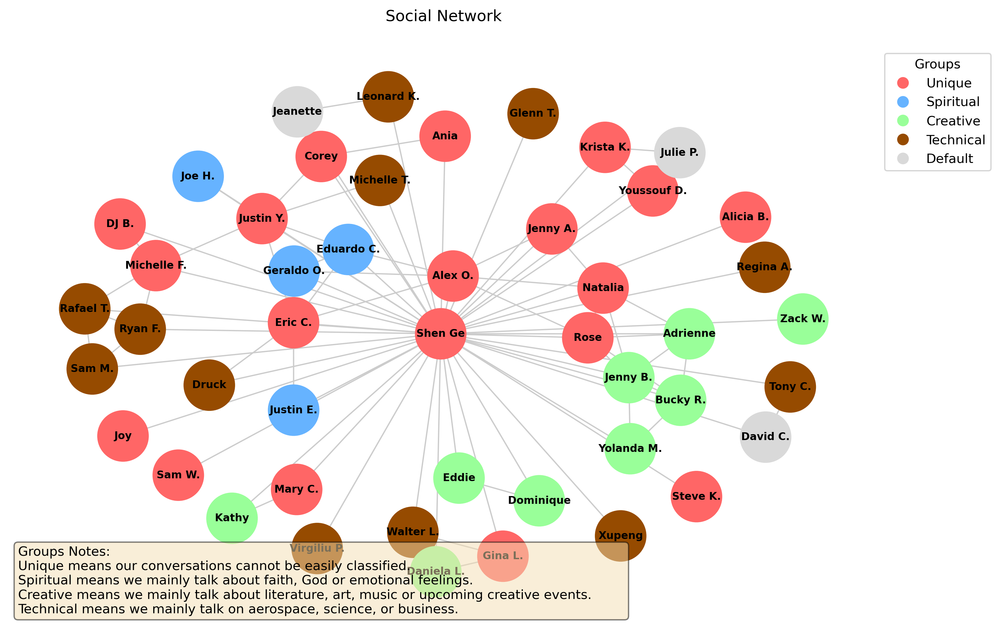

This site contains the project documentation for the
`socialchart` project which generates a simple social network diagram.

Currently it is manually made and only is for Shen. Future plan is to expand that to allow anyone to create a simple social network.

Example of what can be generated as follows:

To create this documentation for testing, simply do: 
`mkdocs serve --livereload`

To create this documentation for live website, simply do:
`mkdocs gh-deploy`

## Table of Contents

1. [Tutorials](tutorials.md)
2. [REference](reference.md)